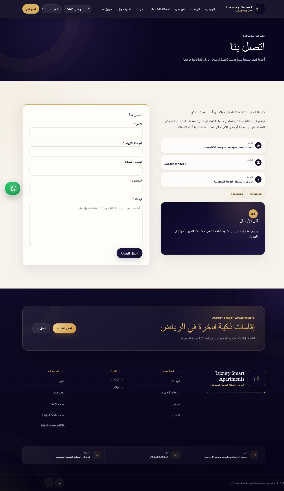
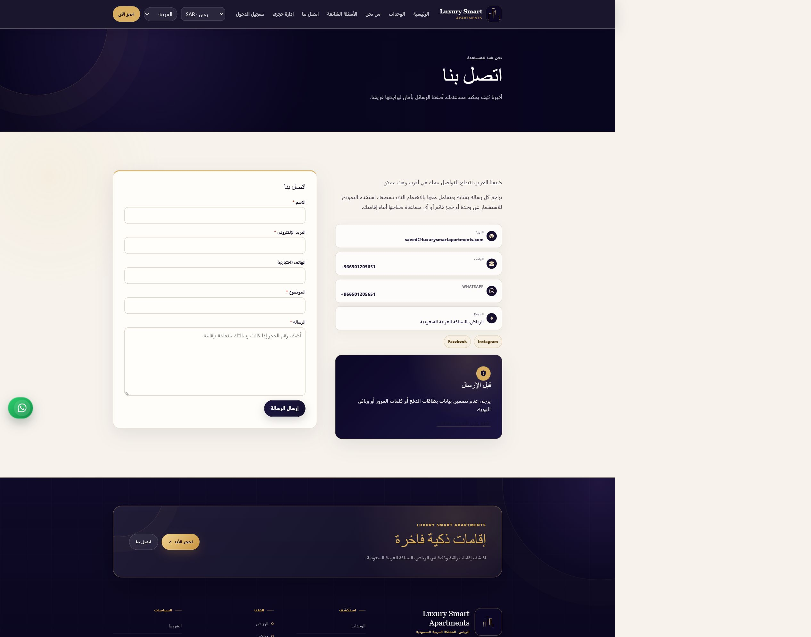
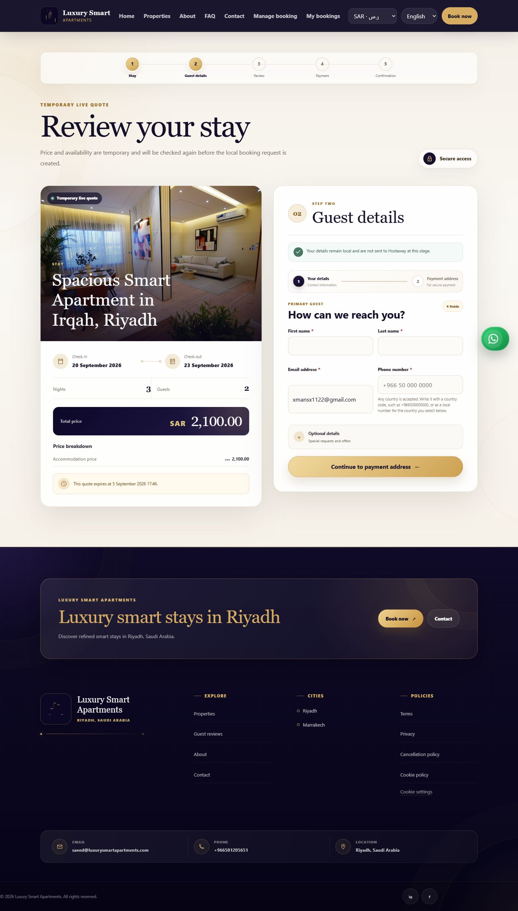
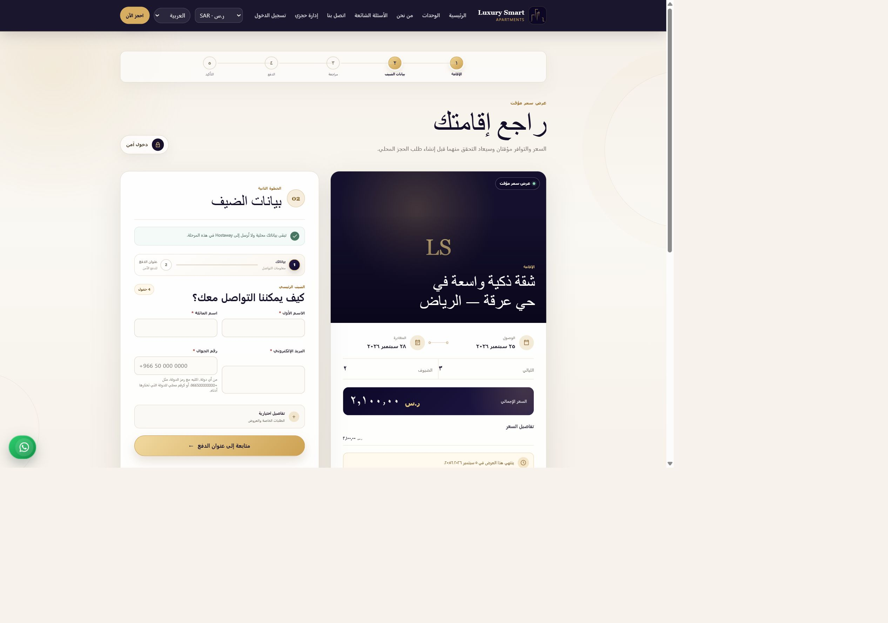
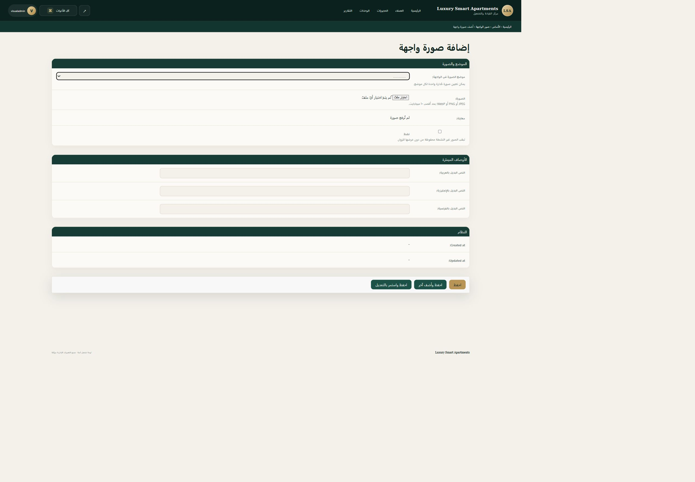

# Guest audit batch 5 — polish and media readiness

## What changed and why

- The wide quote layout now stretches both cards to one intentional baseline,
  keeps the active journey action at the bottom of its card, and reduces only the
  excessive desktop section tail. Mobile retains natural content height and its
  existing sticky action.
- The contact page now presents WhatsApp as a full contact channel using the same
  administrator-managed/fallback target as the floating button. The original
  report called `LSA` a link; the code showed that it was a decorative badge. It
  is replaced with a clear safety shield icon rather than removed as navigation.
- Six homepage photograph placements can now be uploaded and activated from the
  administration dashboard. Active images require Arabic and English alt text,
  accept only the established JPEG/PNG/WebP image contract, and use generated
  paths. Existing Unsplash photographs remain honest fallbacks until the owner
  supplies licensed replacements.
- A real nominated property photograph still has priority over a generic managed
  city image. Hostaway image ownership and synchronization rules are unchanged.
- The property-image delivery architecture is documented as a proposal only; no
  Cloudflare service, proxy, storage copy, CSP change, secret, or production flag
  was introduced.

## Files affected

- `apps/core/models.py`, `apps/core/uploads.py`, migration `0015`, and
  `apps/core/admin.py`: managed interface-image schema, validation, preview, and
  privacy-safe audit entries.
- `apps/core/views.py` and `templates/core/home.html`: six managed placements with
  stock fallbacks and localized alt text.
- `templates/core/contact.html` and `static/css/site.css`: complete WhatsApp
  channel, clear safety icon, and balanced quote layout.
- Arabic, English, and French gettext catalogues.
- `tests/test_site_interface_images.py`, contact-page regression coverage, and an
  independent GitHub Actions quality workflow.
- `property-image-delivery-options.md` and `guest-audit-delivery-summary.md`.
- The configured Ruff gate found pre-existing formatting drift on `origin/main`;
  the batch includes a mechanical formatter pass with no intended behaviour
  change outside the files above.

## Manual verification

1. Open `/contact/` and confirm Email, Phone, WhatsApp, and Location appear as
   equal contact cards.
2. Select WhatsApp and confirm it uses the same number/URL configured in Site
   settings as the floating WhatsApp control.
3. Confirm the “Before you send” panel shows a safety shield, not an unexplained
   `LSA` badge.
4. Open a live quote on a desktop width of at least 1090 px. Confirm the stay and
   guest-detail cards finish on one baseline and the gap before the footer is
   visibly smaller.
5. Repeat at a phone width. Confirm cards stack naturally and the journey action
   remains reachable without an internal blank panel.
6. In administration, open **Core → Interface images** and create one of each
   listed homepage placement.
7. Try activating an image without Arabic or English alt text; confirm saving is
   refused. Add both descriptions and activate it.
8. Open the homepage in Arabic, English, and French. Confirm the managed image and
   the appropriate localized/fallback alt text are rendered.
9. Deactivate the record and confirm the existing stock photograph returns.
10. For a city card with a nominated real property hero, confirm that real image
    remains ahead of the generic city placement.

## Visual evidence

Production before — the contact page lacked a full WhatsApp channel and showed an
ambiguous `LSA` badge:

Branch after — the contact page uses a full WhatsApp card and safety icon:

Production before — the quote section left an oversized tail before the footer:

Branch CSS rendered locally with a synthetic, session-owned quote (no guest,
booking, payment, or provider write) — equal card baselines and a smaller
section tail:

The new administration control has no prior screen to compare. Its post-change
state is recorded here:

## Automated verification

- `pytest`: 1130 passed, 285 existing warnings.
- `ruff check .`: passed.
- `ruff format --check .`: 231 files already formatted.
- `python manage.py check`: no issues.
- `python manage.py check --deploy --settings=config.settings.production`: no
  issues or deployment warnings.
- `python manage.py makemigrations --check`: no changes detected.
- apps/config line coverage: 85.4285%, above the documented `origin/main`
  baseline of 85.3659%.

## Owner decisions still required

1. Supply and approve the six homepage photographs plus Arabic, English, and
   optional French alt text.
2. Select durable production media storage before relying on dashboard uploads;
   Render's current local filesystem is not the production durability boundary.
3. Select a property-image delivery option, budget ceiling, image-copy licence,
   retention period, and source-host allowlist from
   `property-image-delivery-options.md`.

No external-property-image architecture is implemented until those decisions are
approved.
